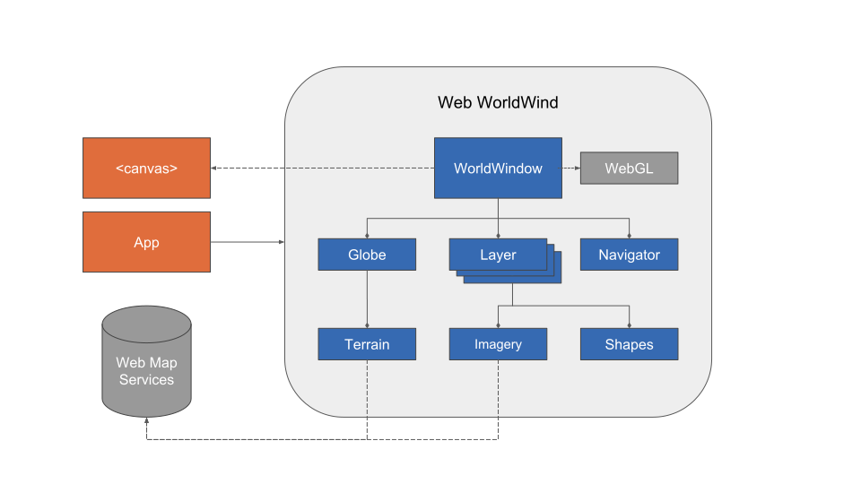

# Concepts

Web WorldWind is a collection of components that interactively display 3D geographic information within a browser. Applications begin using WorldWind by placing one or more HTML5 canvas elements in their user interface. Each canvas is then connected to a WorldWindow, which provides the 3D geographic context for the application’s information and behaviors using WebGL.

WorldWind components are extensible. The API is defined primarily by interfaces, so components can be selectively replaced by alternative components. Concrete classes can also be replaced or extended. Extensibility is a fundamental objective of WorldWind.

There are four major WorldWind interfaces, all shown in the following diagram.

All the objects above can be those provided by WorldWind or those developed by application developers. Objects implementing a particular interface may be used wherever that interface is called for.

### WorldWindow

WorldWindow associates an HTML5 canvas with a WorldWind Globe, Layers, and Navigator. In typical usage, applications create a WorldWindow then configure the globe and layers for their data. WorldWindow manages the display of the globe and its layers using WebGL, in conjunction with an interactive view that defines the user’s view of the planet.

### Globe 

Globe represents a planet’s shape and terrain. The globe has a Tessellator that generates the terrain.

### Layer

Layer applies application imagery, shapes or other information to the globe. These items all retain their position relative to the globe as the user navigates through the geography. Layers also provide in-screen shapes that lie in the plane of the screen and do not move with the globe.

### Navigator

Navigator determines the user’s view within the WorldWindow and is driven by mouse and touch input events from the user.

# Data Retrieval

WorldWind works with enormous quantities of data and information, all of which exist on data servers. Retrieval and browser caching of that data is therefore a necessary and primary feature of WorldWind. As remote data is retrieved it is stored in the browser cache according to the HTTP caching rules and subsequently used from there. All data retrieval is performed on background threads.

# Selection

WorldWind can determine the displayed objects at a given screen point, typically the mouse point or a the location of a touch gesture. It can also determine the geographic position beneath the cursor. Selection operations are provided from simple functions on WorldWindow.

[Index](../../)
