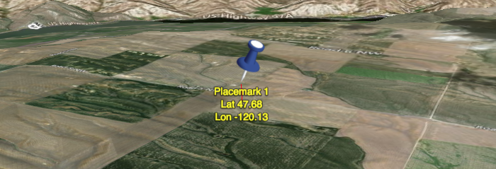

<style>
    iframe {
        width: 100 vw;
        height: 700px;
    }
</style>
# WebWorldWind Placemarks



Placemarks are customizable point markers that maintain their orientation to the screen. Their size is optionally dependent on range to the camera; however, the default configuration keeps them the same size with respect to the screen. Placemarks are highly customizable and support mouse or touch selecting and highlighting. Placemarks are renderables and require a `RenderableLayer` in order to be added the WorldWindow.

## Basic Placemark

1. Start by creating and adding a `RenderableLayer` that will host the Placemarks generated for this lesson. Be sure to add the layer to the WorldWindow.
    
    ```javascript
    var resortLocations = new WorldWind.RenderableLayer("Ski Resort Locations");
    wwd.addLayer(resortLocations);
    ```
    
2. Specify a position for the placemark:

    ```javascript
    var breckenridgePosition = new WorldWind.Position(39.481019, -106.045398, 0);
    ```
    
3. Create a placemark with a label and add it to the layer:

    ```javascript
    var breckenridge = new WorldWind.Placemark(breckenridgePosition);
    breckenridge.label = "Breckenridge";
    resortLocations.addRenderable(breckenridge);
    ```
    
    <script async src="//jsfiddle.net/nasazach/5uz10mxc/2/embed/"></script>
    
4. The default appearance of the placemark is a small white dot which happens to disappear as you move the camera closer. This due to terrain obscuring the dot because we did not modify the altitude mode of the placemark to `CLAMP_TO_GROUND`. Specifying the altitude mode is done by:

    ```javascript
    breckenridge.altitudeMode = WorldWind.CLAMP_TO_GROUND;
    ```
  
    Now you'll notice the white dot stays on top of the terrain and is not obsured as you move the camera closer.
    
5. The default white dot is pretty boring, while we could change the color and size, why not utilize their logo? To utilize a logo we need to point to the images URL using a `PlacemarkAttributes` object. Then we need to provide the attributes to the placemark.

    ```javascript
    var breckenridgeAttributes = new WorldWind.PlacemarkAttributes();
    breckenridgeAttributes.imageSource = "https://zglueck.github.io/workshop-demo/resources/images/breckenridge-logo.png";
    breckenridge.attributes = breckenridgeAttributes;
    ```
    
    